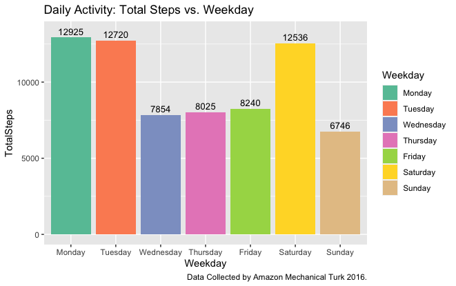

# 📊 Bellabeat Case Study

This case develops the data analysis process of Ask, Prepare, Process, Analyse, Share and Act of the Google Data Analytics Certificate.

* __Time of analysis v1: August 24, 2023.__
* __Tools used in v1: R, Tableau, Excel.__

## Background

Bellabeat, a company in the global market of smart devices, has new business opportunities and wants to design a marketing strategy. This case focuses on the analysis of the data to know the usage trends of the people's smart devices and influence the new strategy.

## Data Analysis Process

### 1. Ask

#### Business Task
Analyze the usage trends of people's smart devices to influence the marketing strategy of Bellabeat globally.

#### Main Stakeholders
* Urška Sršen: Cofunder and Creative Director.
* Sando Mur: Cofunder and Mathematician.

#### Secondary Stakeholders
* Team of data analysis of marketing.

### 2. Prepare

#### Data Source
The datasets come from [FitBit Fitness Tracker Data](https://www.kaggle.com/datasets/arashnic/fitbit?resource=download) published in [Kaggle](https://www.kaggle.com/). It has 18 .CSV files that contain data on the daily activity, calories, weight, sleep, steps, and heart rate of 30 people in a wide format.

#### Data Authorization, Privacy, Security and Accesibility
The data meets the Privacy Information since the data was authorized and consented by each person to further usage and analysis. The information was anonymized and its open.

#### Data Credibility (ROOCC)

The data is:
* __Reliable__: 30 people consented to the submission of personal tracker data, including minute-level output for physical activity, heart rate, and sleep monitoring.
* __Original__: The data was generated in a survey via Amazon Mechanical Turk between March 12, 2016 to May 12, 201, and colleted data from April to May of 2016.

The data is not:
* __Comprehensive__: The data shows information about daily activities and constant tracking, but only collects the data for the period of a month by each person which is not sufficient time to determine patterns.
Also, the data of 30 people is not enough to be representative of the population. In some cases, there is less data such as the heart rate that has only 14 and weight that has 8.
* __Current__: The data was collected 7 years ago from March 12, 2016, to May 12, 2016, and has not been updated or reviewed.
* __Cited__: The data come from a reliable company, Amazon Mechanical Turk, but has not been updated or reviewed. 

#### Data Limitations
The data is subject to limitations:

* __The datasets are bias__: The information of 30 people about physical activity, heart rate, and sleep monitoring is a small example and it's not representative of the population and can lead to wrong analysis and conclusions.
* __The data credibility is not optimize__: The information is realible and original, but has not been updated or reviewed in 7 years and collected data from April to May.

__Data Conclusion: Because of these reasons, the data is subject to limitations, and has not complete credibility to find patterns, help answer questions, or to find solutions.__

### 3. Process

__Tools__: Used tools of order and filter to reviewed the datasets in __R__.

__Data Inconsistencies:__ 
* There are ```NA``` and ```0``` values present in some tables such as Weight Log and Hourly Steps. These will be not considered for the analysis.
* There are differences in the time format when the data was collected daily in many tables, which difficults its merge. This will be change from ```Month/Day/Year 00:00:00 AM``` to ```Month/Day/Year```.
* For the hourly data colleted, the the format will be transform from Date to Hour from ```Month/Day/Year 00:00:00 AM``` to ```00:00```.
* For the daily data collected, some will be transform from the date format in the days of the week from ```Month/Day/Year 00:00:00 AM``` to ```Monday```.
* The data collected in minutes will be change to hours for further analysis and better understanding.

#### Cleaning Process
The complete cleaning detail is documented in ```case_bellabeat.R```.

__a. Date Format transformed__: daily_steps, sleep_day, daily_calories and weight_log data changed from ```Month/Day/Year 00:00:00 AM``` to ```Month/Day/Year```.

```R
daily_steps <- daily_steps %>% 
  mutate(ActivityDay = as.Date(ActivityDay, format = "%m/%d/%Y")) %>% 
  mutate(ActivityDay = format(ActivityDay, format = "%m/%d/%Y")) %>% 
  rename("Date" = "ActivityDay")
```

__b. Date Format transformed to Hour__: hourly_steps and heart_rate changed to separate Date and Hour, from ```Month/Day/Year 00:00:00 AM``` to ```Month/Day/Year``` and ```00:00```.

```R
hourly_steps <- na.omit(hourly_steps)
hourly_steps <- hourly_steps[hourly_steps$StepTotal != 0, ]
hourly_steps$ActivityHour = as.POSIXct(hourly_steps$ActivityHour, format = "%m/%d/%Y %I:%M:%S %p") 
# date
hourly_steps$Date = format(hourly_steps$ActivityHour, format = "%m/%d/%Y")
# hour
hourly_steps$Hour = format(hourly_steps$ActivityHour, format = "%H")
hourly_steps <- subset(hourly_steps, select = -ActivityHour)
```

__c. Date Format transformed to Weekdays__: daily_activity changed from ```Month/Day/Year 00:00:00 AM``` to ```Monday```.

```R
daily_activity$Weekday <- weekdays(as.Date(daily_activity$ActivityDate, format = "%m/%d/%Y"))
# To specify the levels in factor and then order by weekday
daily_activity$Weekday <- ordered(daily_activity$Weekday, levels=c("Monday", "Tuesday", "Wednesday", "Thursday", "Friday", "Saturday", "Sunday"))
```

__d. Transform minutes to hours:__ 

```R
daily_activity$SedentaryHours <- round((daily_activity$SedentaryMinutes/60), 1)
daily_activity$VeryActiveHours <- round((daily_activity$VeryActiveMinutes/60), 1)
```

### 4. Analyse

### 4.1. Summary

| __Daily Activity__   | __Daily Sleep__   |
| ------------- | ------------- | 
| <p align="center"></p> | <p align="center"></p> | 

Daily, the people took 9687 steps and walked 6.5 distance. They spent 12 hours without physical activity, 40 minutes in a very active activity, and burnt 2052 calories. They also slept 7.2 hours and stayed in bed 7.5 hours, and their weight is of 64 Kg average.

| __Hourly Activity__  | 
| ------------- | 
| <p align="center"></p> |

Hourly, people walk 715 steps with a heart rate of 79 and burn 144 calories in average.

### 4.2. Daily Activity

#### Activity Intensity

| <p align="center"></p>   | <p align="center"></p> |
| ------------- | -----------

People engage in a total of 29% of hours of the day doing some physical activity, this means a total of 4,7 hours. They spend 40 minutes in a aery, 30 minutes in a fairly, and 4 hours in a lightly activity.  

On the other hand, in the 71% of the rest of the hours, they spend 12 hours in a sedentary way and not in some activity.

#### Steps

__Daily Activity:__ Total Steps vs. Activity Hours

| <p align="center"></p> | <p align="center"></p>  | 
| ------------- | ------------- | 
| <p align="center"></p> | <p align="center"></p> |

The total of steps and the hours engaged in some physical activity describe the pattern when people are more active they will walk more steps and when they are more sedentary they will walk less.

A highlight is the fact that some of them have high hours in a sedentary way without any physical activity and they show a high number of steps, as if they were engaged in a lightly or fairly activity. We can see the case of people that have more than 10 hours in a sedentary way, and they took between 10000 and 15000 steps.

Another highlight is that some people have high hours in some activity while they show a smaller number of steps, which could mean the probability of them being involved in some exercises that doesn't involve walking like gym exercises.  

__Most active days of the week:__ Total Steps vs. Weekday

<p align="center"></p> 

The most active days are Monday, Tuesday, and Saturday. Monday is the highest with 12925 steps. Meanwhile, Sunday is the less active with a total 6746 steps. The middle of the week describes an average of activity in steps.

#### Calories

__Calories burnt in steps and hours involved:__ 

<p align="center"></p> 

<p align="center"></p> 

As a fact, the most calories are burnt when people walk more and have very active hours.

It is noticed when people are not active, they are sedentary, in these hours they still burn a high amount of calories (2000). This could mean some of them are involved in very lightly activity.

#### Weight

__Relation betweeen Weight and Walking:__ 

| <p align="center"></p>  | <p align="center"></p> |
| ------------- | ------------- |

People present an average weight of 64 Kg while walking and, as an obvious fact, more distance is covered when the number of steps are increasing.

#### Hours asleep

__Relation betweeen Hours Asleep and Walking:__ Hours Asleep vs. Steps

<p align="center"></p> 

There is no direct correlation between __Hours Asleep and Total Steps__. When people sleep between 7 and 8 hours, they have an increasing number of steps. Also, when they sleep less than 5 hours and more than 9 hours, they have a decreasing number of steps.

__Relation betweeen Hours Asleep and Time in Bed:__ 

<p align="center"></p> 

In the chart __Hours Asleep and Hours in Bed__, there is a direct correlation between these two variables, more time spent in hours asleep means more time in bed. From this, we can see people go to bed at least 30 minutes before sleep, time that can fluctuate for each individual.

__Relation betweeen Hours Asleep and Calories:__ 

<p align="center"></p> 

It is an usual question if people burn more calories while sleeping, but there is not a direct relation between __Hours Asleep and Calories__. It is noticed when people sleep 5 to 7.5 hours the amount of calories burnt fluctuate in a close range to 2000. 

A highlight is when people sleep 9.1 hours they walk 20000 steps, the highest calories burnt. Since this fact doesn't repeat, more data is needed to draw further conclusions.

### 4.3. Hourly activity

#### Hours compare to Heart Rate vs. Steps vs. Calories

<p align="center"></p> 

<p align="center"></p> 

<p align="center"></p> 

The __Hourly Activity__ chart reveals that the most active hours are from 17 to 19 p.m. The most active hour is at 18 p.m., when people have the maximum heart rate (86), burn the maximum calories (191), and take the maximum steps of the day (1110).

The lowest activity takes place during the night at 3 p.m., when people have the minimum heart rate (60), burn the minimum calories (71), and take the minimum steps (31), while most of them are asleep.

In the middle of the day, people take 1035 steps with a heart rate of 84 and burn 166 calories. This data is close to the average reviewed in the Summary before. 

#### Steps vs. Heart Rate vs. Calories

<p align="center"></p>

The chart __Steps vs. Heart Rate vs. Calories__, describes the positive relation between the number of steps and the heart rate and calories.

### 5. Share

Presentation
Tableau 

### 6. Act

#### Findings and Conclusions 

__The usage trends of people's smart devices are:__
* They are engaged in some physical activity in a total of 4,7 hours of the day: 40 minutes in a very, 30 minutes in a fairly, and 4 hours in a lightly intensity activity.
* They spend 12 hours of the day being sedentary.
* The most active days of the week are Monday, Tuesday, and Saturday while the least is Sunday.
* People who sleep between 7 and 8 hours have an increasing number of steps, meaning an increase in their daily activity.
* People go to bed at least 30 minutes before sleep, time they spend awake in bed.
* The most active hours of the day are 17, 18 and 19 p.m. The highest hour of activity when people have the maximum heart rate, burn the maximum calories, and take the maximum steps is at 18 p.m. 

__Important note:__
More data must be collected with more people who consent to the use of their personal information. The data will have a sample that is representative of the population and more certain to make a better analysis and identify trends. As an example: 
* Sample estimated of 500 individuals for a short-term of at least 2 years.

