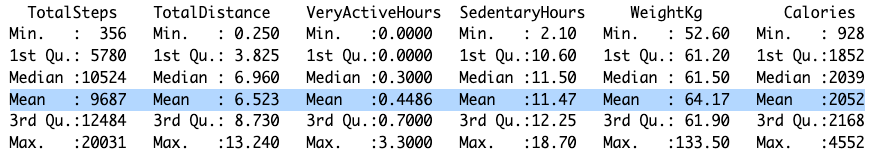
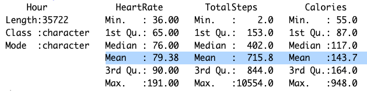

# 📊 Bellabeat Case Study

This case develops the data analysis process of Ask, Prepare, Process, Analyse, Share and Act of the Google Data Analytics Certificate.

* __Time of analysis v1: August 24, 2023.__
* __Tools used in v1: R, Tableau, Excel.__

## Background

Bellabeat, a company in the global market of smart devices, has new business opportunities and wants to design a marketing strategy. This case focuses on the analysis of the data to know the usage trends of the people's smart devices and influence the new strategy.

## Data Analysis Process

### 1. Ask

#### Business Task
Analyze the usage trends of people's smart devices to influence the marketing strategy of Bellabeat globally.

#### Main Stakeholders
* Urška Sršen: Cofunder and Creative Director.
* Sando Mur: Cofunder and Mathematician.

#### Secondary Stakeholders
* Team of data analysis of marketing.

### 2. Prepare

#### Data Source
The datasets come from [FitBit Fitness Tracker Data](https://www.kaggle.com/datasets/arashnic/fitbit?resource=download) published in [Kaggle](https://www.kaggle.com/). It has 18 .CSV files that contain data on the daily activity, calories, weight, sleep, steps, and heart rate of 30 people in a wide format.

#### Data Authorization, Privacy, Security and Accesibility
The data meets the Privacy Information since the data was authorized and consented by each person to further usage and analysis. The information was anonymized and its open.

#### Data Credibility (ROOCC)

The data is:
* __Reliable__: 30 people consented to the submission of personal tracker data, including minute-level output for physical activity, heart rate, and sleep monitoring.
* __Original__: The data was generated in a survey via Amazon Mechanical Turk between March 12, 2016 to May 12, 201, and colleted data from April to May of 2016.

The data is not:
* __Comprehensive__: The data shows information about daily activities and constant tracking, but only collects the data for the period of a month by each person which is not sufficient time to determine patterns.
Also, the data of 30 people is not enough to be representative of the population. In some cases, there is less data such as the heart rate that has only 14 and weight that has 8.
* __Current__: The data was collected 7 years ago from March 12, 2016, to May 12, 2016, and has not been updated or reviewed.
* __Cited__: The data come from a reliable company, Amazon Mechanical Turk, but has not been updated or reviewed. 

#### Data Limitations
The data is subject to limitations:

* __The datasets are bias__: The information of 30 people about physical activity, heart rate, and sleep monitoring is a small example and it's not representative of the population and can lead to wrong analysis and conclusions.
* __The data credibility is not optimize__: The information is realible and original, but has not been updated or reviewed in 7 years and collected data from April to May.

__Data Conclusion: Because of these reasons, the data is subject to limitations, and has not complete credibility to find patterns, help answer questions, or to find solutions.__

### 3. Process

__Tools__: Used tools of order and filter to reviewed the datasets in __R__.

__Data Inconsistencies:__ 
* There are ```NA``` and ```0``` values present in some tables such as Weight Log and Hourly Steps. These will be not considered for the analysis.
* There are differences in the time format when the data was collected daily in many tables, which difficults its merge. This will be change from ```Month/Day/Year 00:00:00 AM``` to ```Month/Day/Year```.
* For the hourly data colleted, the the format will be transform from Date to Hour from ```Month/Day/Year 00:00:00 AM``` to ```00:00```.
* For the daily data collected, some will be transform from the date format in the days of the week from ```Month/Day/Year 00:00:00 AM``` to ```Monday```.
* The data collected in minutes will be change to hours for further analysis and better understanding.

#### Cleaning Process
The complete cleaning detail is documented in ```case_bellabeat.R```.

__a. Date Format transformed__: daily_steps, sleep_day, daily_calories and weight_log data changed from ```Month/Day/Year 00:00:00 AM``` to ```Month/Day/Year```.

```R
daily_steps <- daily_steps %>% 
  mutate(ActivityDay = as.Date(ActivityDay, format = "%m/%d/%Y")) %>% 
  mutate(ActivityDay = format(ActivityDay, format = "%m/%d/%Y")) %>% 
  rename("Date" = "ActivityDay")
```

__b. Date Format transformed to Hour__: hourly_steps and heart_rate changed from ```Month/Day/Year 00:00:00 AM``` to ```00:00```.

```R
hourly_steps$ActivityHour = as.POSIXct(hourly_steps$ActivityHour, format = "%m/%d/%Y %I:%M:%S %p") 
hourly_steps$ActivityHour = format(hourly_steps$ActivityHour, format = "%H")
hourly_steps <- rename(hourly_steps, "Hour" = "ActivityHour" )
```

__c. Date Format transformed to Weekdays__: daily_activity changed from ```Month/Day/Year 00:00:00 AM``` to ```Monday```.

```R
daily_activity$Weekday <- weekdays(as.Date(daily_activity$ActivityDate, format = "%m/%d/%Y"))
# To specify the levels in factor and then order by weekday
daily_activity$Weekday <- ordered(daily_activity$Weekday, levels=c("Monday", "Tuesday", "Wednesday", "Thursday", "Friday", "Saturday", "Sunday"))
```

__d. Transform minutes to hours:__ 

```R
daily_activity$SedentaryHours <- round((daily_activity$SedentaryMinutes/60), 1)
daily_activity$VeryActiveHours <- round((daily_activity$VeryActiveMinutes/60), 1)
```

### 4. Analyse

### 4.1. Summary

| __Daily Activity__   | __Daily Sleep__   |
| ------------- | ------------- | 
| <p align="center"></p> | <p align="center"></p> | 

Daily, the people took 9687 steps and walked 6.5 distance. They spent 11 hours without activity, 40 minutes in a very active activity, and burnt 2052 calories. They also slept 7.2 hours and stayed in bed 7.5 hours, and their weight is of 64 Kg average.

| __Hourly Activity__  | 
| ------------- | 
| <p align="center"></p> |

Hourly, people took 715 steps with a heart rate of 79 and burnt 144 calories in average.

### 4.2. Steps

__Daily Activity:__ Total Steps vs. Calories

<p align="center"></p> 


__Daily Activity:__ Total Steps vs. Activity Hours

| <p align="center"></p> | <p align="center"></p>  | 
| ------------- | ------------- | 
| <p align="center"></p> | <p align="center"></p> |

<p align="center"></p> 

<p align="center"></p> 

<p align="center"></p> 

<p align="center"></p> 

<p align="center"></p>  

<p align="center"></p> 

<p align="center"></p> 

<p align="center"></p> 

<p align="center"></p> 

### Hourly activity

<p align="center"></p> 

<p align="center"></p> 

<p align="center"></p> 

<p align="center"></p>


### 5. Share

Presentation
Tableau 

### 6. Act

## Conclusions

* The data must have a sample that is representative of the population. 